# Assignment 4 Submission

```ini
[Name :] Immadisetty Anvith ( 2302536 )
```

## Table of Contents

- [Step 1: Log in to VM and Create Remote Storage Directory](#step-1-log-in-to-vm-and-create-remote-storage-directory)
- [Step 2: Set Up Python Virtual Environment](#step-2-set-up-python-virtual-environment)
- [Step 3: Install DVC and Initialize Repository](#step-3-install-dvc-and-initialize-repository)
- [Step 4: Configure Remote Storage](#step-4-configure-remote-storage)
- [Step 5: Track Main Data Using DVC](#step-5-track-main-data-using-dvc)
- [Step 6: Add Monthly Data Progressively](#step-6-add-monthly-data-progressively)
- [Step 7: Checkout and Verify Specific Data Versions](#step-7-checkout-and-verify-specific-data-versions)

---

## Step 1: Log in to VM and Create Remote Storage Directory

To begin, log in to the virtual machine where the assignment will be set up. Use the `ssh` command to access the server, and then create a directory for storing remote data using the `mkdir` command. This step ensures that the necessary environment is prepared for the subsequent tasks.

```bash
ssh anvit@npci-sandbox.talentsprint.com
mkdir -p /home/anvit/assignment-4
```

---

## Step 2: Set Up Python Virtual Environment

Setting up a Python virtual environment is critical for managing dependencies in an isolated environment. The following commands create and activate a virtual environment using Python's built-in `venv` module.

```bash
python3 -m venv env
source env/bin/activate
```

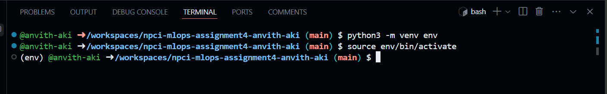

---

## Step 3: Install DVC and Initialize Repository

To enable version control for your data, install the Data Version Control (DVC) tool and initialize a DVC repository. These commands also include steps to track the initialization changes with Git.

```bash
pip install dvc==3.55.2 dvc-ssh==4.1.1 asyncssh==2.18.0
dvc init
git add .dvc .dvcignore
git commit -m "Initialize DVC"
```

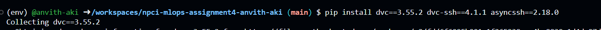

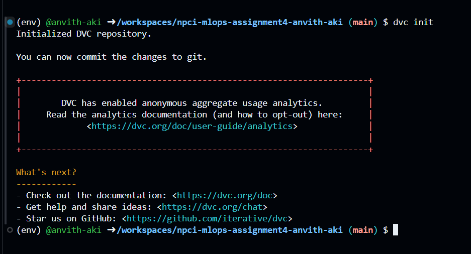

---

## Step 4: Configure Remote Storage

Configure a remote storage location for DVC to store large data files. This setup uses SSH as the remote storage protocol. Replace `<your-vm-password>` with the actual password of your virtual machine.

```bash
dvc remote add -d myremote ssh://anvit@npci-sandbox.talentsprint.com:22/home/anvit/assignment-4
dvc remote modify --local myremote password <your-vm-password>
git add .dvc/config
git commit -m "Remote storage configured"
git push
```

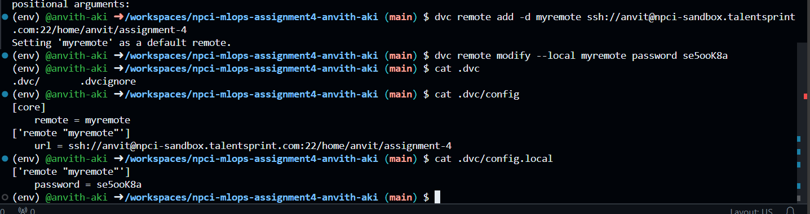

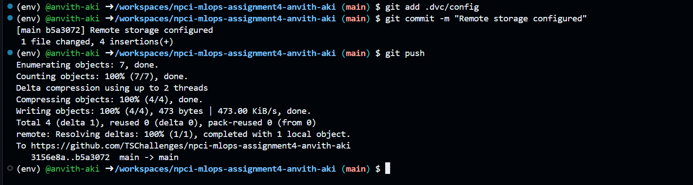

---

## Step 5: Track Main Data Using DVC

The main dataset is tracked using DVC to enable versioning and collaboration. After adding the dataset, commit the changes to Git and push them to both the remote storage and the Git repository.

```bash
dvc add data/data_main.csv
git add data/data_main.csv.dvc data/.gitignore
git commit -m "Add main dataset to DVC"
dvc push
git tag v1
git push origin v1
```

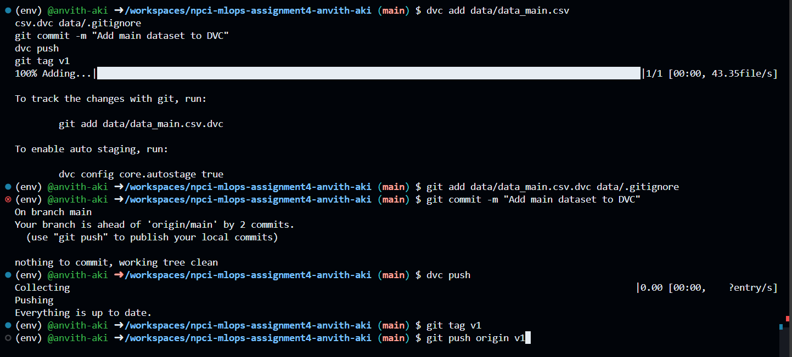

---

## Step 6: Add Monthly Data Progressively

To update the dataset with new monthly data, run the data aggregator script, track the updated data with DVC, and push the changes to the remote storage and Git repository. The example below demonstrates the steps for updating with new data.

![Note :] Use below command to install pandas as the `data_aggregator.py` uses pandas to aggregate the data.

```bash
pip install pandas
```

Now, use below commands to aggregate data and tag/update dvc.

```bash
python data_aggregator.py
dvc add data/data_main.csv
git add data/data_main.csv.dvc
git commit -m "Update main dataset with new monthly data"
dvc push
git tag v2
git push origin v2
```

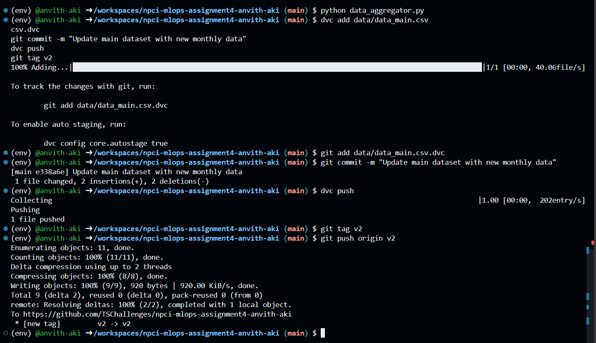

Repeat the above steps for additional monthly data updates. For example, for Month 3:

```bash
python data_aggregator.py
dvc add data/data_main.csv
git add data/data_main.csv.dvc
git commit -m "Update main dataset with new monthly data"
dvc push
git tag v3
git push origin v3
```

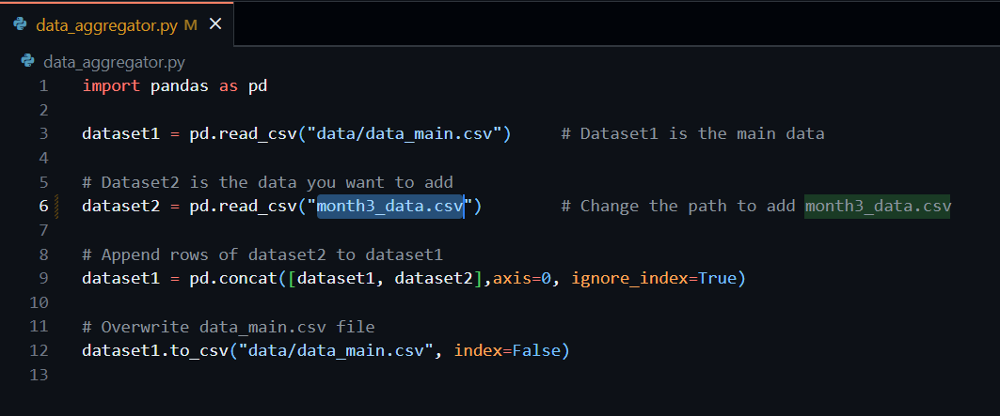

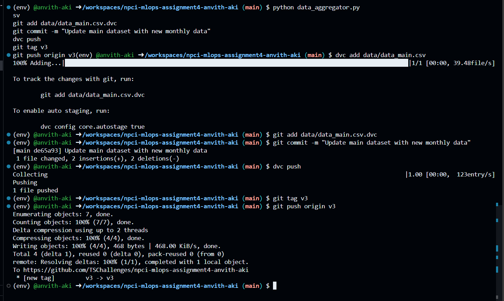

Screenshot for the Final files in VM

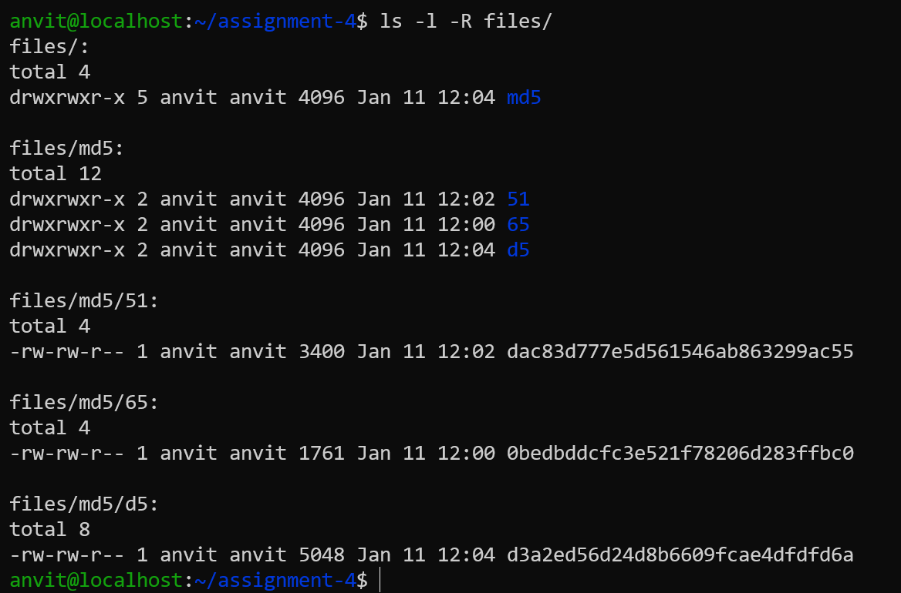

---

## Step 7: Checkout and Verify Specific Data Versions

To retrieve a specific version of the dataset, clone the repository, checkout to the desired Git tag, and pull the associated data files using DVC. This process ensures the correct dataset version is retrieved for verification or further processing.

1. Clone the repository:

Replace the `<git-repository-url>` and `<repository-directory>` with your actual values

```bash
# git clone <git-repository-url>
git clone https://github.com/TSChallenges/npci-mlops-assignment4-anvith-aki.git

# cd <repository-directory>
cd npci-mlops-assignment4-anvith-aki
```

2. Configure a remote storage location password using below command for security purpose not storing actual credentials in git. Replace `<your-vm-password>` with the actual password of your virtual machine.

```bash
# dvc remote modify --local myremote password <your-vm-password>

# for-user: anvit
# vm-password: se5ooK8a

dvc remote modify --local myremote password se5ooK8a
```

3. Checkout to the desired tag (e.g., `v1`):

```bash
git checkout v1
```

4. Pull the data files associated with the tag:

```bash
dvc pull
```

5. Verify the dataset version:

Check the dataset content or metadata to confirm the retrieved version matches expectations.

```bash
ls data/
cat data/data_main.csv
```

By following these steps, you can manage and verify specific data versions efficiently.

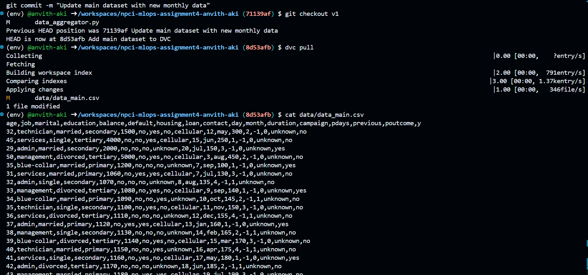

---